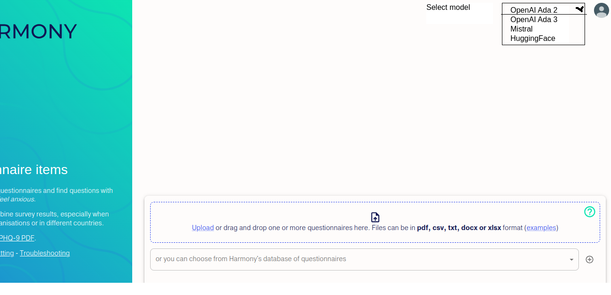

# Exploring ways to improve Harmony's matching

I took cosine vs correlations dataset by McElroy et al and tried changing Harmony's model to see what improves the R² value.

1. For original Harmony we get R² = 0.25
2. OpenAI's Ada 2 model gives us R² = 0.38
3. OpenAI's Ada 3 model gives us R² = 0.34

The scripts for evaluating different variants of Harmony against the cosine correlations dataset and other datasets are in this repo.

So how can we improve the matching? I guess the easiest way would be to switch this underlying model, rather than trying anything clever.

I explored what kind of questions led to Harmony deviating from the correlations in the data. For example it looks like these two correlate highly but Harmony gives a low score, as expected:

_Have had difficulty concentrating? =  Had feelings of worthlessness or guilt?_

Here are the words that are very common for Harmony's false positives and false negatives. Harmony is prone to thinking things are similar because of words like "sleep", and misses matches containing "worthlessness", "guilt", etc.

```
Strongest predictors for class 0 harmony false positive

0       sleeping
1       asleep
2       falling
3       staying
4       upsetting
5       clearly
6       dreams
7       part
8       replay
9       related
10      alert
11      watchful
12      super
13      guard
14      moving
15      come
16      into
Strongest predictors for class 1 harmony missed

0       reading
1       newspaper
2       such
3       television
4       watching
5       normal
6       from
7       less
8       worthlessness
9       guilt
10      relaxing
11      concentrating
12      doing
13      worried
14      interest
15      pleasure
16      reduced
```

Maybe the solution is to have an option to select the model in the UI. The current model runs on Ulster's servers, but OpenAI would need an API key. We don't have so many users so it would probably only cost a few pounds a month, but I'm not sure how it works with Wellcome's conditions.



Here are some false positives and false negatives coming out of Harmony.


```
CORRELATIONS WHICH HARMONY DIDN'T PREDICT (FALSE NEGATIVES)

Experienced less interest or pleasure from normal activities for most of the day? 
        =  Felt hopeless?
Little interest or pleasure in doing things? 
        =  Feeling down, depressed, or hopeless?
Felt down or depressed for most of the day? 
        =  Experienced less interest or pleasure from normal activities for most of the day?
Worried a lot about different things? 
        =  Felt physically tense or agitated?
Had feelings of worthlessness or guilt? 
        =  Felt hopeless?
Have had difficulty concentrating? 
        =  Had feelings of worthlessness or guilt?
Experienced less interest or pleasure from normal activities for most of the day? 
        =  Have had difficulty concentrating?
Had difficulty concentrating? 
        =  Been easily annoyed by different things?
Felt nervous or anxious? 
        =  Worried a lot about different things?
Felt “on edge”? 
        =  Had difficulty concentrating?

CORRELATIONS WHICH HARMONY INCORRECTLY PREDICTED (FALSE POSITIVES)

Feeling tired or having little energy? 
        =  Having upsetting dreams that replay part of the experience or are clearly related to the experience? 
Feeling tired or having little energy? 
        =  Being so restless that it is hard to sit still?
Experienced sleep disturbances? 
        =  Having upsetting dreams that replay part of the experience or are clearly related to the experience? 
Trouble falling or staying asleep, or sleeping too much? 
        =  Being so restless that it is hard to sit still?
Trouble falling or staying asleep, or sleeping too much? 
        =  Having upsetting dreams that replay part of the experience or are clearly related to the experience? 
Feeling tired or having little energy? 
        =  Being “super-alert”, watchful, or on guard?
Had recurrent thoughts of death or suicide? 
        =  Trouble falling or staying asleep, or sleeping too much?
Trouble falling or staying asleep, or sleeping too much? 
        =  Moving or speaking so slowly that other people could have noticed? Or the opposite - being so fidgety or restless that you have been moving around a lot more than usual?
Trouble falling or staying asleep, or sleeping too much? 
        =  Thoughts that you would be better off dead, or of hurting yourself in some way?
Trouble falling or staying asleep, or sleeping too much? 
        =  Being “super-alert”, watchful, or on guard?

```